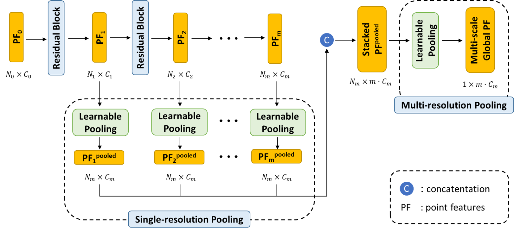

# PointStack

<p align = 'center'>

</p>

This repository provides an unofficial and modified PyTorch implementation for the following paper:

**Advanced Feature Learning on Point Clouds using Multi-resolution Features and Learnable Pooling**<br>
[Kevin Tirta Wijaya](https://www.ktirta.xyz), [Dong-Hee Paek](http://ave.kaist.ac.kr/bbs/board.php?bo_table=sub1_2&wr_id=5), and [Seung-Hyun Kong](http://ave.kaist.ac.kr/)<br>
[\[**arXiv**\]](https://arxiv.org/abs/2205.09962)
> **Abstract:** *Existing point cloud feature learning networks often incorporate sequences of sampling, neighborhood grouping, neighborhood-wise feature learning, and feature aggregation to learn high-semantic point features that represent the global context of a point cloud.
Unfortunately, such a process may result in a substantial loss of granular information due to the sampling operation.
Moreover, the widely-used max-pooling feature aggregation may exacerbate the loss since it completely neglects information from non-maximum point features.
Due to the compounded loss of information concerning granularity and non-maximum point features, the resulting high-semantic point features from existing networks could be insufficient to represent the local context of a point cloud, which in turn may hinder the network in distinguishing fine shapes.
To cope with this problem, we propose a novel point cloud feature learning network, PointStack, using multi-resolution feature learning and learnable pooling (LP).
The multi-resolution feature learning is realized by aggregating point features of various resolutions in the multiple layers, so that the final point features contain both high-semantic and high-resolution information.
On the other hand, the LP is used as a generalized pooling function that calculates the weighted sum of multi-resolution point features through the attention mechanism with learnable queries, in order to extract all possible information from all available point features.
Consequently, PointStack is capable of extracting high-semantic point features with minimal loss of information concerning granularity and non-maximum point features.
Therefore, the final aggregated point features can effectively represent both global and local contexts of a point cloud.
In addition, both the global structure and the local shape details of a point cloud can be well comprehended by the network head, which enables PointStack to advance the state-of-the-art of feature learning on point clouds.
Specifically, PointStack outperforms various existing feature learning networks for shape classification and part segmentation on the ScanObjectNN and ShapeNetPart datasets.*

## Modifications
The main modifications are adding in a predict.py script that means that any trained bonsai model can be used to predict unlabeled point clouds of bonsai trees. This repository is meant to be use in conjuction with the following repository used to prepare the data:
https://github.com/tedtheturtlenz/PointCloud_Prep


## Preparations


**To install the requirements**:

```setup
# 1. Create new environment
conda create -n <environment name> python=3.7

# 2. Install PyTorch with corresponding cudatoolkit, for example,
pip3 install torch torchvision torchaudio --extra-index-url https://download.pytorch.org/whl/cu113

# 3. Install other requirements
pip install -r requirements.txt
```

**To install the PointCloud_Prep Repository**
Clone https://github.com/tedtheturtlenz/PointCloud_Prep
Read the README to know how to prepare the data.


**To prepare the dataset**:

1. Create empty directories for 'modelnet40', 'partnormal', and 'scanobjectnn' inside './data' directory.
2. Download the corresponding dataset for [Modelnet40](https://github.com/AnTao97/PointCloudDatasets), [ShapeNetPart](https://shapenet.cs.stanford.edu/media/shapenetcore_partanno_segmentation_benchmark_v0_normal.zip), and [ScanObjectNN](https://hkust-vgd.github.io/scanobjectnn/). Create the Bonsai dataset using the PointCloud_Prep scripts.
3. Prep your own custom dataset using the PointCloud_Prep repository mentioned above.
4. Create 'data' and 'experiments' directories on the workspace if they are not already there, and organize as follows,

```

This repository expects the following directory setup:
D:/
  |-- Bonsai
        |-- Code
              |-- PythonDev
                    |-- PointStack
                            |-- .venv
                            |-- PointStack
                                    |-- cfgs
                                    |-- core
                                    |-- data
                                          |-- modelnet40
                                                |-- .json files
                                                |-- .txt files
                                          |-- partnormal
                                                |-- dirs
                                                |-- synsetoffset2category.txt
                                          |-- scanobjectnn
                                                |-- dirs
                                          |-- bonsai
                                                |-- dirs
                                                |-- synsetoffset2category.txt
                                    |-- experiments
                            |-- Input_Point_Clouds_Color
                            |-- Output_Predicted_Point_Clouds
                            |-- To_Predict
                            |-- To_Predict_Color
                            |-- Training_Point_Clouds
                    |-- PointCloud_Prep
                            |-- .venv
                            |-- Segmented-Meshes

But by editing the references in the code these can be adjusted.

```

## Training

To train the network, run this command:

```train
python train.py --cfg_file <path_to_cfg_yaml (str)> --exp_name <experiment_name (str)> --val_steps <eval_every_x_epoch (int)>
```

## Evaluation

To evaluate the network with pre-trained weights, run:

```eval
python test.py --cfg_file <path_to_cfg_yaml (str)> --ckpt <path_to_ckpt_pth (str)>
```

## Predicting
To predict a Bonsai point cloud with a pre-trained model, run the predict.py script
Or modify the batch file included in this repository to automate this process.

## Other Scripts
### create_datasplit.py
This script gets all the point clouds in the pointstack/data/bonsai folder, and creates the .json files for listing the names of the point clouds that are in the train, test, and validate splits.

### create_coloured_classes
This script is used to automatically match the predicted point clouds with their RGB data from the unpredicted point clouds.


## Results 

Our pretrained model achieves the following performances on :

### [3D Point Cloud Shape Classification on ModelNet40](https://paperswithcode.com/sota/3d-point-cloud-classification-on-modelnet40)

| Model name         | Overall Accuracy  | Class Mean Accuracy |
| ------------------ |---------------- | -------------- |
| [PointStack](https://drive.google.com/file/d/1Emw8kR48htvPSNZ7e2UjO1CKy8W857s6/view?usp=sharing)   |     93.3         |      89.6%       |

### [3D Point Cloud Shape Classification on ScanObjectNN](https://paperswithcode.com/sota/3d-point-cloud-classification-on-scanobjectnn)

| Model name         | Overall Accuracy  | Class Mean Accuracy |
| ------------------ |---------------- | -------------- |
| [PointStack](https://drive.google.com/file/d/1XTfYSkc0m4GKEhcV0wLAsb8GJ3-hBaiz/view?usp=sharing)   |     87.2%         |      86.2%       |

### [3D Part Segmentation on ShapeNetPart](https://paperswithcode.com/sota/3d-part-segmentation-on-shapenet-part)

| Model name         | Instance mIoU  | 
| ------------------ |---------------- |
| [PointStack](https://drive.google.com/file/d/1Gab0_Cmdc-QFDgdMnWNMCP1NnE4_Uex1/view?usp=sharing)   |     87.2%         |
